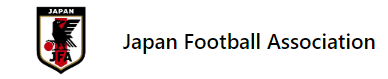

<a name="readme-top"></a>

<div align="center">
  <a href="https://github.com/JojorioCh/L5-Mission0">
    
  </a>
<h3 align="center">Project Blue Lock example Website</h3>
</div>
<details>
<summary>T.O.C</summary>
<ol>
   <li>
      <a href="#about-the-project">About The Project</a>
      <ul>
        <li><a href="#built-with">Built With</a></li>
      </ul>
    </li>
    <li>
      <a href="#getting-started">Getting Started</a>
    </li>
    <li><a href="#contact">Contact</a></li>
    <li><a href="#acknowledgments">Acknowledgments</a></li>
  </ol>
</details>

## About the Project


This Website was built as part of a class Mission Project with a focus of using a Listing Website Wireframe. 

I created this by referencing an Anime that I have enjoyed that has to do with sports named Blue Lock. What I was aiming to do was create a database for the fictional characters that were chosen to participate in the project.

Although my whole dream isn't completed yet, this has the begginnings of what can be done for the site. 

<p align="right">(<a href="#readme-top">back to top</a>)</p>

### Built With

- [![React][React.js]][React-url] 
- [Mantine UI](https://mantine.dev) 

<br />

## Getting Started

1. Clone the repo
   ```sh
   git clone https://github.com/JojorioCh/L5-Mission0.git
   ```
2. Install NPM packages
   ```sh
   npm install
   ```
3. Have fun ヾ(⌐■_■)ノ♪

<p align="right">(<a href="#readme-top">back to top</a>)</p>

<br/>

## Contact

Joseph Chang - [Joseph Chang](https://www.linkedin.com/in/joseph-chang-b25977144/) - joesfound@gmail.com

Project Link: [https://github.com/JojorioCh/L5-Mission0.git](https://github.com/JojorioCh/L5-Mission0.git)

<br />

## Acknowledgments

- [Mantine](https://mantine.dev/) Helped me a lot in creating this website.

- [W3School](https://www.w3schools.com/) A great resource when you have trouble remembering some coding.

- Would also like to Thank Hans Coalie the UX Designer who helped with giving feedback for this project.

<p align="right">(<a href="#readme-top">back to top</a>)</p>

<!-- MARKDOWN LINKS & IMAGES -->
<!-- https://www.markdownguide.org/basic-syntax/#reference-style-links -->

[React.js]: https://img.shields.io/badge/React-20232A?style=for-the-badge&logo=react&logoColor=61DAFB
[React-url]: https://reactjs.org/
